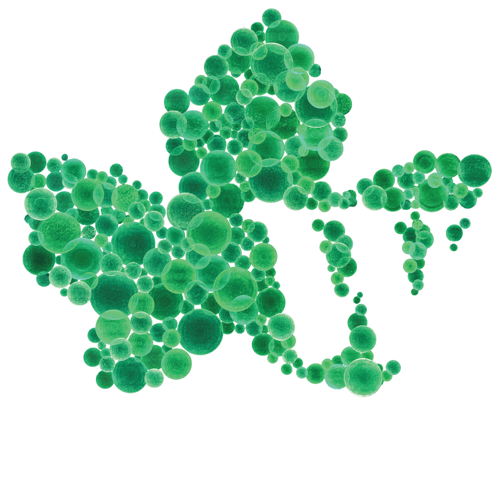

# Green Poultry Farm Moçambique - Website Setup Guide

## 📁 File Structure

Your website consists of the following files:
- `index.html` - Main homepage
- `green-poultry.html` - Green Poultry Farm project page
- `styles.css` - Stylesheet for both pages
- `script.js` - JavaScript for interactivity and language switching

## 🖼️ Adding Your Images

### 1. Logo Files Required

Place these logo files in the same directory as your HTML files:

- **GPFlogo.png** - Green Poultry Farm logo (used on both pages)
- **agro-logo.png** - Agro Energia Moçambique logo (used in navigation and footer)

### 2. Icon Images (index.html - Main Page)

These small icon images are needed for the About and Contact sections:

**About Section Icons:**
```
icon-sustainability.png - Sustainability icon (80x80px recommended)
icon-innovation.png - Innovation icon (80x80px recommended)
icon-community.png - Community Focus icon (80x80px recommended)
icon-vision.png - Vision icon (100x100px recommended)
```

**Contact Section Icons:**
```
icon-email.png - Email icon (60x60px recommended)
icon-phone.png - Phone icon (60x60px recommended)
icon-location.png - Location icon (60x60px recommended)
```

**Icon Specifications:**
- Format: PNG with transparent background
- Simple, clean design
- Monochrome or brand colors (green/yellow)
- Will display in grayscale and show color on hover

### 3. Solution Images (index.html - Main Page)

These images represent your main renewable energy solutions:

```
solution-biogas.png - Biogas Technologies (80x80px recommended)
solution-solar.png - Solar Energy Systems (80x80px recommended)
solution-software.png - Energy Management Software (80x80px recommended)
```

**Solution Image Specifications:**
- Format: PNG with transparent background
- Size: 80x80px recommended
- Style: Icons or photographs that represent each technology
- Brand colors preferred (green/yellow)
- Clean, professional appearance

### 4. SDG Logo Images (index.html)

Download the official UN Sustainable Development Goals logos from the UN website and add these 7 SDG images:

```
sdg-1.png - No Poverty
sdg-2.png - Zero Hunger
sdg-7.png - Affordable and Clean Energy
sdg-8.png - Decent Work and Economic Growth
sdg-12.png - Responsible Consumption and Production
sdg-13.png - Climate Action
sdg-15.png - Life on Land
```

**SDG Logo Specifications:**
- Download from: https://www.un.org/sustainabledevelopment/news/communications-material/
- Use square format logos
- Recommended size: 400x400px
- Format: PNG
- Keep official UN colors

### 4. Gallery Images (green-poultry.html)

Replace the placeholder image sources with your actual photos. You need 8 images:

```html
gallery-1.jpg - Biodigester Installation
gallery-2.jpg - Farmer Training Session
gallery-3.jpg - Portable Biodigester Unit
gallery-4.jpg - High-Efficiency Cooking Stove
gallery-5.jpg - Community Engagement
gallery-6.jpg - Biogas Production System
gallery-7.jpg - Organic Biofertilizer
gallery-8.jpg - IoT Monitoring System
```

**Recommended Image Specifications:**
- Format: JPG or PNG
- Dimensions: 800x600 pixels (4:3 ratio)
- File size: Under 500KB each for faster loading
- Quality: High resolution, well-lit, professional

### 3. Partner Logos (green-poultry.html)

Add your partner logos (6 slots available):

```html
partner-1.png
partner-2.png
partner-3.png
partner-4.png
partner-5.png
partner-6.png
```

**Partner Logo Specifications:**
- Format: PNG with transparent background preferred
- Dimensions: 300x300 pixels maximum
- File size: Under 200KB each
- The logos will be displayed in grayscale by default and show in color on hover

### 4. Award Logos (green-poultry.html)

Add your award logos and update the award names (4 slots available):

```html
award-1.png
award-2.png
award-3.png
award-4.png
```

**Award Logo Specifications:**
- Format: PNG with transparent background
- Dimensions: 200x200 pixels recommended
- File size: Under 150KB each
- Circular format works best

**To Update Award Names:**

Find this section in `green-poultry.html` and update the text:

```html
<div class="award-item">
    <div class="award-logo">
        
    </div>
    <h4 data-en="Your Award Name Here" data-pt="Nome do Prêmio em Português">Your Award Name Here</h4>
    <p data-en="Awarding Organization" data-pt="Organização Concedente">Awarding Organization</p>
</div>
```

## 🌐 Language Support

The website supports English and Portuguese. To add/edit translations:

1. Find elements with `data-en` and `data-pt` attributes
2. Update the text for both languages

Example:
```html
<h2 data-en="English Text Here" data-pt="Texto em Português Aqui">
    English Text Here
</h2>
```

## 📱 Social Media Links

Update the LinkedIn link in the footer of `green-poultry.html`:

```html
<a href="https://www.linkedin.com/company/green-poultry-farm-mozambique/" aria-label="LinkedIn">IN</a>
```

Add other social media links as needed (Facebook, Twitter, etc.)

## 🚀 Deployment Instructions

### Option 1: Simple Hosting
1. Place all files (HTML, CSS, JS) and images in one folder
2. Upload the entire folder to your web hosting service
3. Ensure `index.html` is in the root directory

### Option 2: GitHub Pages (Free)
1. Create a GitHub repository
2. Upload all files to the repository
3. Go to Settings → Pages
4. Select the branch and root folder
5. Your site will be live at `https://yourusername.github.io/repository-name`

### Option 3: Netlify (Free)
1. Create a Netlify account
2. Drag and drop your folder to Netlify
3. Your site will be live instantly with a custom domain option

## ✏️ Customization Tips

### Changing Colors
Edit the CSS variables in `styles.css`:

```css
:root {
    --primary-green: #2d5f3f;    /* Main green color */
    --accent-yellow: #f4c542;    /* Yellow accent */
    --cream: #f5f3ed;            /* Background cream */
}
```

### Adding More Gallery Images
1. Add new `<div class="gallery-item">` blocks in the gallery section
2. Follow the same structure as existing items
3. The grid will automatically adjust

### Adding More Partners/Awards
Simply duplicate the existing partner/award item blocks and update the content.

## 📧 Contact Form

The contact form currently shows a notification when submitted. To make it functional:

1. **Using FormSpree (Free):**
   - Sign up at https://formspree.io
   - Get your form endpoint
   - Update the form tag: `<form action="https://formspree.io/f/YOUR_ID" method="POST">`

2. **Using Netlify Forms:**
   - Add `netlify` attribute to the form tag
   - Forms will be available in your Netlify dashboard

3. **Custom Backend:**
   - Modify the form submission handler in `script.js`
   - Connect to your own API endpoint

## 🔧 Technical Requirements

- Modern web browser (Chrome, Firefox, Safari, Edge)
- No server-side processing required (static website)
- Works on all devices (mobile, tablet, desktop)

## 📞 Support

For technical questions or assistance with setup, contact your web developer or refer to:
- HTML/CSS documentation: https://developer.mozilla.org/
- Web hosting guides: Your hosting provider's documentation

## ✅ Checklist Before Going Live

**Main Page (index.html):**
- [ ] Agro Energia logo added (agro-logo.png)
- [ ] Green Poultry Farm logo added (GPFlogo.png)
- [ ] About section icons added (4 icons)
- [ ] Contact section icons added (3 icons)
- [ ] SDG logos downloaded and added (7 logos)
- [ ] Contact information verified
- [ ] Social media links updated

**Green Poultry Page (green-poultry.html):**
- [ ] Green Poultry Farm logo added (GPFlogo.png)
- [ ] Gallery images uploaded (8 images)
- [ ] Partner logos added (up to 6)
- [ ] Award logos and names updated (up to 4)

**Both Pages:**
- [ ] Portuguese translations reviewed
- [ ] Test on mobile device
- [ ] Test all navigation links
- [ ] Test language toggle
- [ ] Test contact form

## 📋 Complete Image List

Here's a comprehensive list of all images needed:

**Logos:**
1. agro-logo.png
2. GPFlogo.png

**Icons (Main Page - About & Contact):**
3. icon-sustainability.png
4. icon-innovation.png
5. icon-community.png
6. icon-vision.png
7. icon-email.png
8. icon-phone.png
9. icon-location.png

**Solution Images (Main Page):**
10. solution-biogas.png
11. solution-solar.png
12. solution-software.png

**SDG Logos (Main Page):**
13. sdg-1.png
14. sdg-2.png
15. sdg-7.png
16. sdg-8.png
17. sdg-12.png
18. sdg-13.png
19. sdg-15.png

**Gallery (Green Poultry Page):**
20. gallery-1.jpg through gallery-8.jpg (8 images)

**Partners (Green Poultry Page):**
28. partner-1.png through partner-6.png (6 images)

**Awards (Green Poultry Page):**
34. award-1.png through award-4.png (4 images)

**Total: 38 images needed**

## 🎨 Image Optimization Tips

Before uploading images:
1. Resize to recommended dimensions
2. Compress using tools like TinyPNG or ImageOptim
3. Use descriptive filenames (e.g., "biodigester-installation.jpg")
4. Ensure good lighting and professional quality

---

**Need Help?** Keep this README handy for reference!
